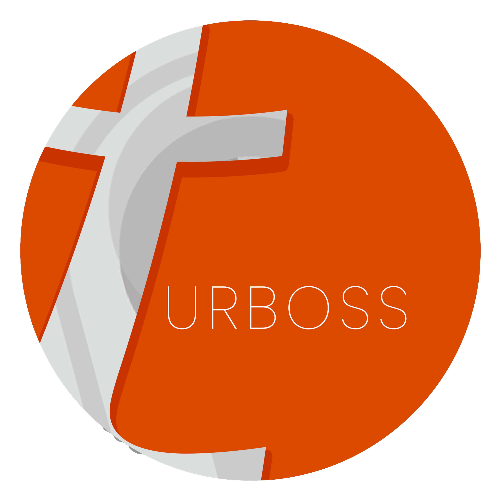
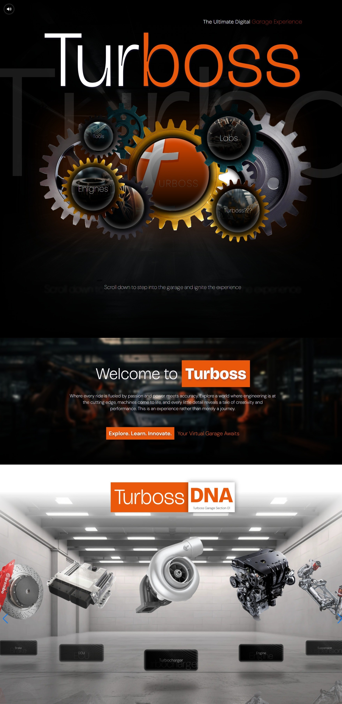

# TURBOSS Digital Garage



This is a [Next.js](https://nextjs.org) project created to explore modern web development with React and server-side rendering. The website is currently under development and aims to provide a seamless user experience with optimized performance.




The "Turboss" platform is a cutting-edge web application designed to showcase advanced tools and technologies. It provides users with detailed insights, interactive visualizations, and a rich user interface to explore various topics. The platform emphasizes performance, accessibility, and modern design principles.

The application is designed to serve as a modern blogging platform, enabling users to create, share, and discover content effortlessly. It leverages server-side rendering for faster load times and improved SEO.

## Getting Started

To run the project locally, use the following command:

```bash
npm run dev
# or
yarn dev
# or
pnpm dev
# or
bun dev
```

Open [http://localhost:3000](http://localhost:3000) in your browser to view the application.

You can start editing the page by modifying `app/page.tsx`. The page auto-updates as you make changes.

## Learn More

To learn more about Next.js, check out the following resources:

- [Next.js Documentation](https://nextjs.org/docs) - learn about Next.js features and API.
- [Learn Next.js](https://nextjs.org/learn) - an interactive Next.js tutorial.

You can also visit [the Next.js GitHub repository](https://github.com/vercel/next.js) for more information and to contribute to the project.

